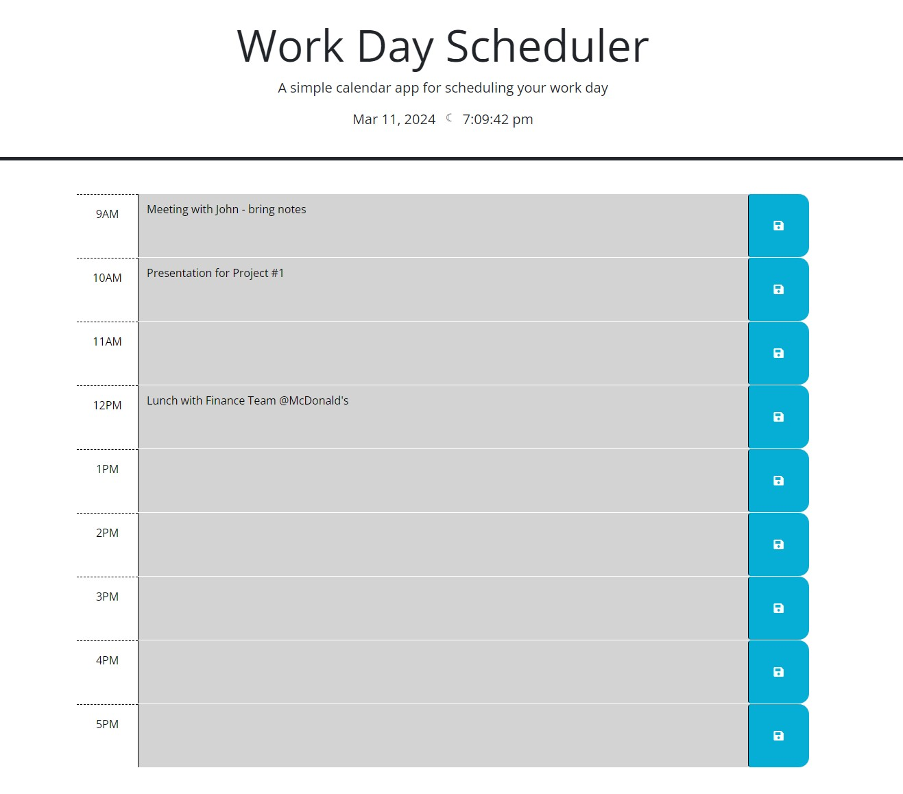
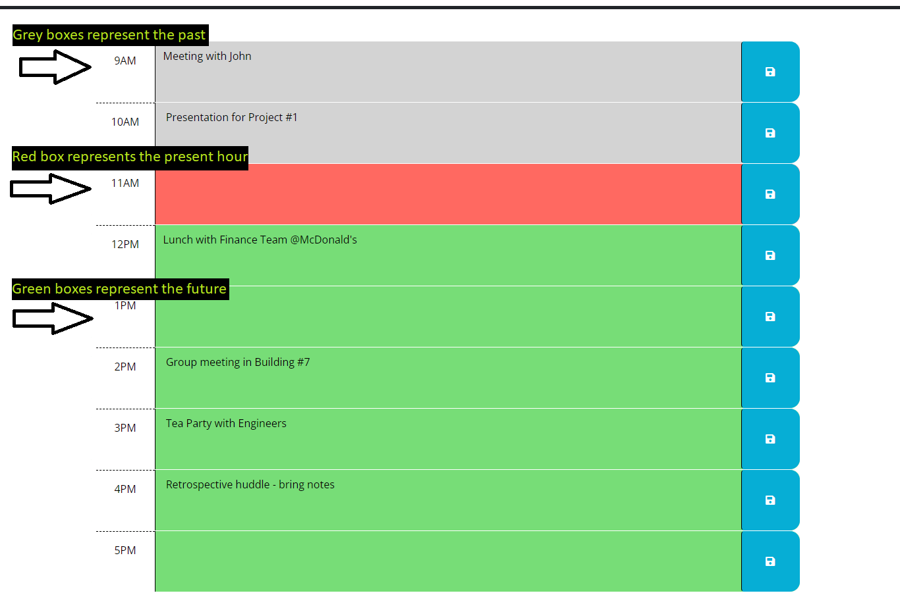
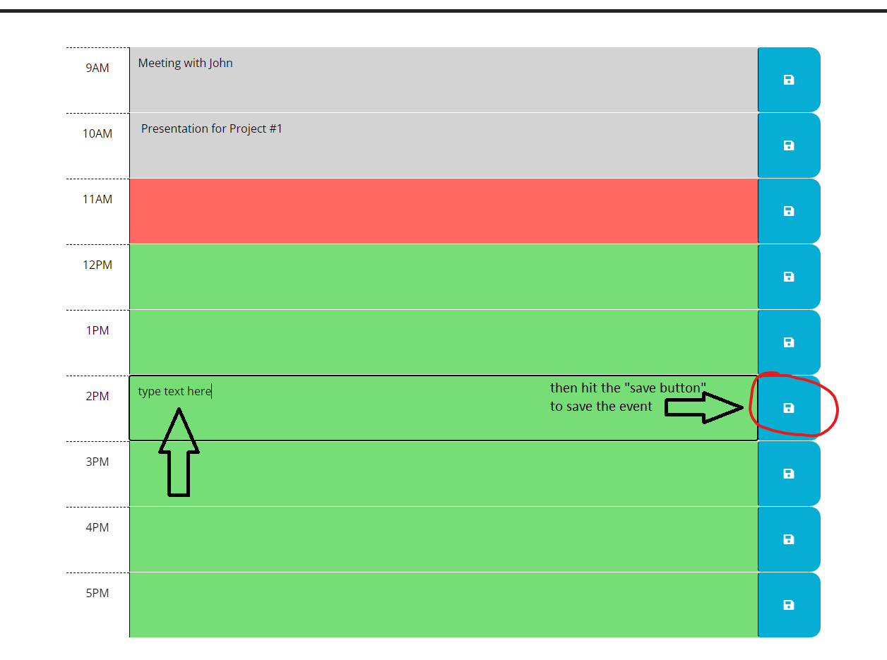

# Simple Work Day Scheduler

## Description

A simple planner/scheduler for a work day can be surprisingly helpful to add structure and make our hectic lives easier. Instead of having a notepad and paper to write down tasks throughout the day, what better way to have a convenient planner exists other than having one right in your browser, as a web page? 

This Work Day Scheduler is a dynamic web page that allows users to log their tasks each day and highlights the current hour's tasks and reminders. With this dynamically changing style as the hours pass during the day, users will be able to see tasks/reminders in the past, current tasks to do that hour, and see what lies ahead in the future hours. Hopefully this can aid people to be more productive and add structure to their busy work day!

To complete this project, I utilized Day.js functionality to allow the website to track the current time of the user. Using custom dataset attributes, the styling of the time blocks responds to the current Day.js information. Additionally, I utilized JQuery and Local Storage to add functionality for users to store tasks with the click of a button, and have those tasks be preserved upon refreshing or reloading the page. This was a great way to keep my JavaScript and API skills sharp!

## Installation

N/A

## Usage

To use the scheduler, use this [link](https://ajprobel.github.io/work-day-planner/)

You will be greated by a simple header that says "Work Day Scheduler." Inside the header, below that, you'll find the current date and time (this site utilizes Day.js to gather current time information).

Below the header are various time blocks separated by hour - these range from 9AM to 5PM: a standard work day. Each row contains a label for the time, a text description box, and a "save" button. Each text description box will be a different color depending on the time: time blocks in the past will be **grey**; time blocks in the future will be **green**; and the current time block is **red.**

Click each colored box and type an event/reminder that occurs in that hour. Once done typing, click on the blue "save" button on the right-most side of the row. That event will now be saved and preserved upon page refresh/reload.

**The first screenshot shows how the webpage will look outside of working hours - all grey boxes**

## Credits

Starter code provided by the Programming Bootcamp of UNC Chapel Hill: HTML and CSS starter Framework
Website functionality created by me, James Probel

Thank you to the JQuery API documentation for guidelines on usage:
https://api.jquery.com/children/
https://api.jquery.com/has-attribute-selector/

## License

Refer to the included project MIT license.